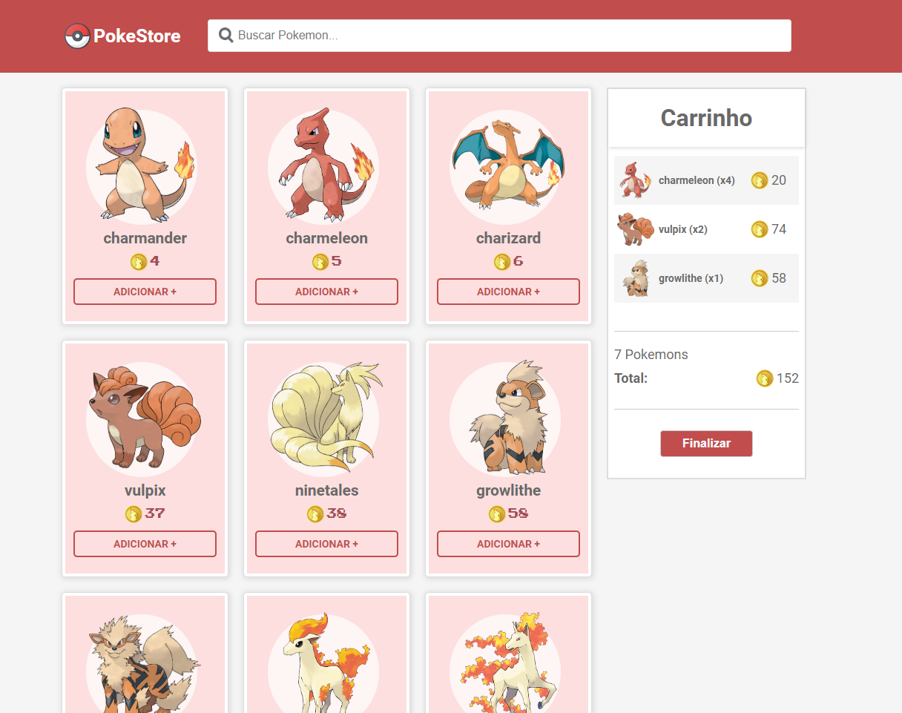
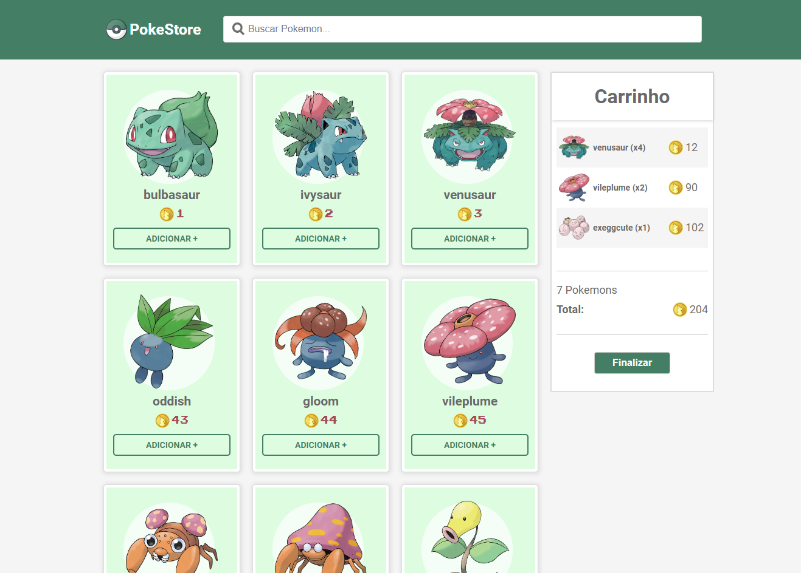

# Desafio - PokeStore


### Instalação das dependências do projeto:
 Agora, para ver a aplicação funcionando em sua máquina você precisa seguir os seguintes passos:

```sh
$ yarn install
ou
$ npm install
```

### Para executar o projeto:

```sh
$ npm start
ou
$ yarn start
```

 Para começar a comprar seus pokemon (Sim, o plural de Pokemon é Pokemon, haha) você pode acessar a PokeStore dos Pokemon de fogo clicando [aqui](https://desafio-pokestore.netlify.app/fire) , ou clicar [aqui](https://desafio-pokestore.netlify.app/grass) para a loja dos Pokemon do tipo Grama.

### Links dos temas:
 
 -- Para acessar a PokeStore de Fogo: http://localhost:3000/fire
 -- Para acessar a PokeStore de Grama: http://localhost:3000/grass

### Tecnologias:

- **React / JavaScript**

### Screenshots do Projeto:
-PokeStore de fogo


-PokeStore de Grama


### Funcionalidades do projeto:

* Catálogo de produtos
* Carrinho lateral
* Resumo do carrinho
* 2 lojas com estilos e tipos diferentes de Pokémon
* Barra de busca para filtrar os Pokémon
* Botão de finalizar compra, reiniciando o processo de compra
* Modal de obrigado ao finalizar compra

